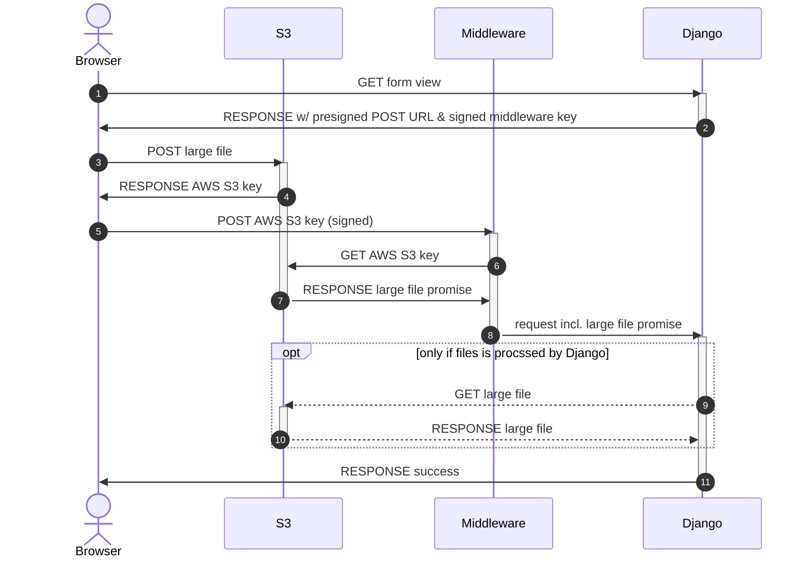

<p align="center">
  <picture>
    <source media="(prefers-color-scheme: dark)" srcset="https://github.com/codingjoe/django-s3file/raw/main/images/logo-dark.svg">
    <source media="(prefers-color-scheme: light)" srcset="https://github.com/codingjoe/django-s3file/raw/main/images/logo-light.svg">
    
  </picture>
<br>
  <a href="https://github.com/codingjoe/django-s3file?tab=readme-ov-file">Documentation</a> |
  <a href="https://github.com/codingjoe/django-s3file/issues/new/choose">Issues</a> |
  <a href="https://github.com/codingjoe/django-s3file/releases">Changelog</a> |
  <a href="https://github.com/sponsors/codingjoe">Funding</a> 💚
</p>

# django-s3file

A lightweight file upload input for Django and Amazon S3.

Django-S3File allows you to upload files directly AWS S3 effectively
bypassing your application server. This allows you to avoid long running
requests from large file uploads. This is particularly helpful for if
you run your service on AWS Lambda or Heroku where you have a hard
request limit.

[](https://pypi.python.org/pypi/django-s3file/)
[](https://codecov.io/gh/codingjoe/django-s3file)
[](https://raw.githubusercontent.com/codingjoe/django-s3file/main/LICENSE)

## Features

- lightweight: less 200 lines
- no JavaScript or Python dependencies (no jQuery)
- easy integration
- works just like the built-in
- extendable JavaScript API

## For the Nerds



In a nutshell, we can bypass Django completely and have AWS handle
the upload or any processing. Of course, if you want to do something
with your file in Django, you can do so, just like before, with the
added advantage, that your file is served from within your datacenter.

## Installation

Make sure you have [Amazon S3
storage](http://django-storages.readthedocs.io/en/latest/backends/amazon-S3.html)
setup correctly.

Just install S3file using `pip`.

```bash
pip install django-s3file
# or
pipenv install django-s3file
```

Add the S3File app and middleware in your settings:

```python
# settings.py

INSTALLED_APPS = (
    "...",
    "s3file",
    "...",
)

MIDDLEWARE = (
    "...",
    "s3file.middleware.S3FileMiddleware",
    "...",
)
```

## Usage

S3File automatically replaces Django's `ClearableFileInput` widget, you
do not need to alter your code at all.

The `ClearableFileInput` widget is only than automatically replaced when
the `STORAGES["default"]` setting is set to `django-storages`'
`S3Boto3Storage` or the dummy `FileSystemStorage` is enabled.

### Setting up the AWS S3 bucket

#### Upload folder

S3File uploads to a single folder. Files are later moved by Django when
they are saved to the `upload_to` location.

It is recommended to [setup
expiration](http://docs.aws.amazon.com/AmazonS3/latest/dev/intro-lifecycle-rules.html)
for that folder, to ensure that old and unused file uploads don't add up
and produce costs.

The default folder name is: `tmp/s3file` You can change it by changing
the `S3FILE_UPLOAD_PATH` setting.

#### CORS policy

You will need to allow `POST` from all origins. Just add the following
to your CORS policy.

```json
[
  {
    "AllowedHeaders": [
        "*"
    ],
    "AllowedMethods": [
        "POST"
    ],
    "AllowedOrigins": [
        "*"
    ],
    "ExposeHeaders": [],
    "MaxAgeSeconds": 3000
  }
]
```

### Using S3File in development

Using S3File in development can be helpful especially if you want to use
the progress signals described above. Therefore, S3File comes with a AWS
S3 dummy backend. It behaves similar to the real S3 storage backend. It
is automatically enabled, if the `STORAGES["default"]` setting is set
to `FileSystemStorage`.

To prevent users from accidentally using the `FileSystemStorage` and the
insecure S3 dummy backend in production, there is also an additional
deployment check that will error if you run Django's deployment check
suite:

```shell
python manage.py check --deploy
```

We recommend always running the deployment check suite as part of your
deployment pipeline.

### Uploading multiple files

Django does have limited support for [uploading multiple
files](https://docs.djangoproject.com/en/stable/topics/http/file-uploads/#uploading-multiple-files).
S3File fully supports this feature. The custom middleware ensures
that files are accessible via `request.FILES`, even though they have
been uploaded to AWS S3 directly and not to your Django application
server.

### Using optimized S3Boto3Storage

Since `S3Boto3Storage` supports storing data from any other fileobj, it
uses a generalized `_save` function. This leads to the frontend
uploading the file to S3 and then copying it byte-by-byte to perform a
move operation just to rename the uploaded object. For large files this
leads to additional loading times for the user.

That's why S3File provides an optimized version of this method at
`storages_optimized.S3OptimizedUploadStorage`. It uses the more
efficient `copy` method from S3, given that we know that we only copy
from one S3 location to another.

```python
from s3file.storages_optimized import S3OptimizedUploadStorage


class MyStorage(S3OptimizedUploadStorage):  # Subclass and use like any other storage
    default_acl = "private"
```
