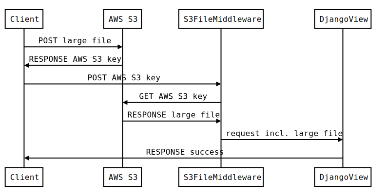

=============
django-s3file
=============

A lightweight file upload input for Django and Amazon S3.

Django-S3File allows you to upload files directly AWS S3 effectively
bypassing your application server. This allows you to avoid long running
requests from large file uploads. This is particularly helpful for if
you run your service on AWS Lambda or Heroku where you have a hard request
limit.

|PyPi Version| |Build Status| |Test Coverage| |GitHub license|

--------
Features
--------

-  lightweight: less 200 lines
-  no JavaScript or Python dependencies (no jQuery)
-  easy integration
-  works just like the built-in
-  extendable JavaScript API

-------------
For the Nerds
-------------

------------
Installation
------------

Make sure you have `Amazon S3 storage`_ setup correctly.

Just install S3file using ``pip``.

.. code:: bash

    pip install django-s3file
    # or
    pipenv install django-s3file

Add the S3File app and middleware in your settings:

.. code:: python

    INSTALLED_APPS = (
        '...',
        's3file',
        '...',
    )

    MIDDLEWARE = (
        '...',
        's3file.middleware.S3FileMiddleware',
        '...',
    )

-----
Usage
-----

S3File automatically replaces Django’s ``ClearableFileInput`` widget,
you do not need to alter your code at all.

The ``ClearableFileInput`` widget is only than automatically replaced
when the ``DEFAULT_FILE_STORAGE`` setting is set to
``django-storages``\ ’ ``S3Boto3Storage``.

Setting up the AWS S3 bucket
----------------------------

Upload folder
~~~~~~~~~~~~~

S3File uploads to a single folder. Files are later moved by Django when
they are saved to the ``upload_to`` location.

It is recommended to `setup expiration`_ for that folder, to ensure that
old and unused file uploads don’t add up and produce costs.

The default folder name is: ``tmp/s3file`` You can change it by changing
the ``S3FILE_UPLOAD_PATH`` setting.

CORS policy
~~~~~~~~~~~

You will need to allow ``POST`` from all origins. Just add the following
to your CORS policy.

.. code:: xml

    <CORSConfiguration>
        <CORSRule>
            <AllowedOrigin>*</AllowedOrigin>
            <AllowedMethod>POST</AllowedMethod>
            <MaxAgeSeconds>3000</MaxAgeSeconds>
            <AllowedHeader>*</AllowedHeader>
        </CORSRule>
    </CORSConfiguration>

Progress Bar
------------

S3File does emit progress signals that can be used to display some kind of progress bar.
Signals named ``progress`` are emitted for both each individual file input as well as
for the form as a whole.

The progress signal carries the following details:

.. code:: javascript

    console.log(event.detail)

    {
        progress: 0.4725307607171312  // total upload progress of either a form or single input
        loaded: 1048576  // total upload progress of either a form or single input
        total: 2219064  // total bytes to upload
        currentFile: File {…}  // file object
        currentFileName: "text.txt"  // file name of the file currently uploaded
        currentFileProgress: 0.47227834703299176  // upload progress of that file
        originalEvent: ProgressEvent {…} // the original XHR onprogress event
    }

The following example implements a Boostrap progress bar for upload progress of an
entire form.

.. code:: html

    

      
0%

    

.. code:: javascript

    (function () {
        var form = document.getElementsByTagName('form')[0]
        var progressBar = document.getElementsByClassName('progress-bar')[0]

        form.addEventListener('progress', function (event) {
            // event.detail.progress is a value between 0 and 1
            var percent = Math.round(event.detail.progress * 100)

            progressBar.setAttribute('style', 'width:' + percent + '%')
            progressBar.setAttribute('aria-valuenow', percent)
            progressBar.innerText = percent + '%'
        })
    })()

Using S3File in development
---------------------------

Using S3File in development can be helpful especially if you want to use the progress
signals described above. Therefore, S3File comes with a AWS S3 dummy backend.
It behaves similar to the real S3 storage backend. It is automatically enabled, if the
``DEFAULT_FILE_STORAGE`` setting is set to ``FileSystemStorage``.

To prevent users from accidentally using the ``FileSystemStorage`` and the insecure S3
dummy backend in production, there is also an additional deployment check that will
error if you run Django's deployment check suite::

    python manage.py check --deploy

We recommend always running the deployment check suite as part of your deployment
pipeline.

Uploading multiple files
------------------------

Django does have limited support for `uploading multiple files`_. S3File
fully supports this feature. The custom middleware makes ensure that
files are accessible via ``request.FILES``, even though they have been
uploaded to AWS S3 directly and not to your Django application server.

.. _Amazon S3 storage: http://django-storages.readthedocs.io/en/latest/backends/amazon-S3.html
.. _setup expiration: http://docs.aws.amazon.com/AmazonS3/latest/dev/intro-lifecycle-rules.html
.. _uploading multiple files: https://docs.djangoproject.com/en/stable/topics/http/file-uploads/#uploading-multiple-files

.. |PyPi Version| image:: https://img.shields.io/pypi/v/django-s3file.svg
   :target: https://pypi.python.org/pypi/django-s3file/
.. |Build Status| image:: https://travis-ci.org/codingjoe/django-s3file.svg?branch=master
   :target: https://travis-ci.org/codingjoe/django-s3file
.. |Test Coverage| image:: https://codecov.io/gh/codingjoe/django-s3file/branch/master/graph/badge.svg
   :target: https://codecov.io/gh/codingjoe/django-s3file
.. |GitHub license| image:: https://img.shields.io/badge/license-MIT-blue.svg
   :target: https://raw.githubusercontent.com/codingjoe/django-s3file/master/LICENSE
